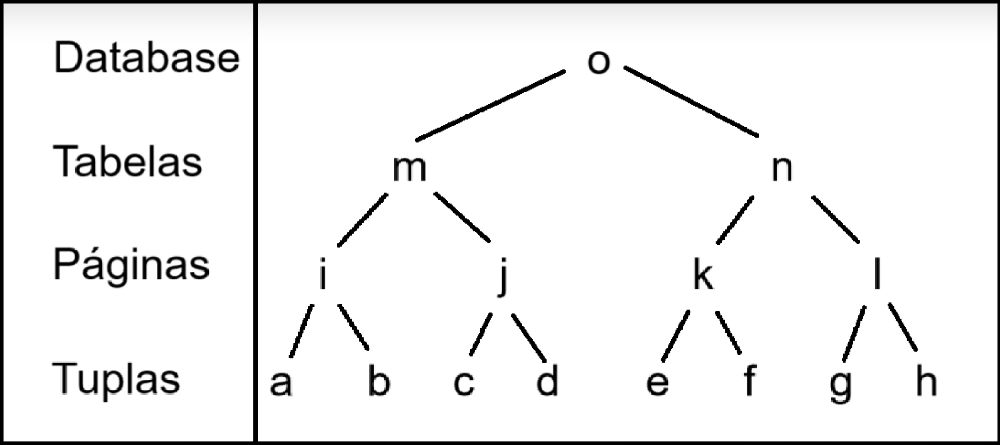

# 2V2PL

Implementation of the 2V2PL protocol for concurrency control with support for multiple lock granularities and deadlock detection/prevention using the wait-for graph strategy.


---

### Build and Run Instructions

1. Navigate to the root directory of the project.
2. Create a build directory by running `mkdir build`, and then navigate into it with `cd build`.
3. Inside the `build` directory, generate the necessary build files (Makefile) by running `cmake ..`.
4. Compile the project using the generated Makefile by executing `make`.
5. Once compiled, run the program using the command `./main/main`.

The program will then wait for input representing operations on the objects defined in the database schema. The schema is provided below:



#### Example Input:

```
w0(a) r1(b) u2(c) w3(a) c0 c1 c2 c3
```


